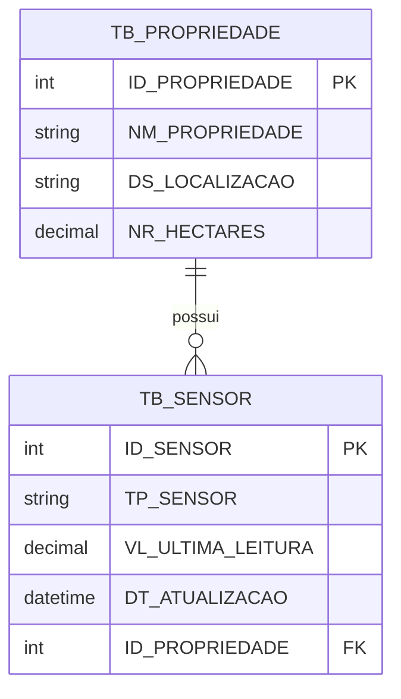

# AeroSoil AI - Web API .NET 8

## Descrição do Projeto

O **AeroSoil AI** é uma Web API desenvolvida em **.NET 8** para uma plataforma de agricultura de precisão. A solução conecta o conceito de economia espacial, com uso futuro de dados orbitais de satélites para análise climática e umidade, a sensores IoT locais instalados no solo, como sensores de umidade e luminosidade.

A API permite o cadastro de propriedades agrícolas e seus sensores, fornecendo uma base relacional para monitoramento de dados ambientais e apoio à tomada de decisão sobre irrigação.

Este projeto foi desenvolvido para a disciplina **Advanced Business Development with .NET**, da FIAP, atendendo aos requisitos técnicos solicitados para a Global Solution.

---

## Tecnologias Utilizadas

- .NET 8
- ASP.NET Core Web API
- Entity Framework Core
- Oracle Database
- Oracle.EntityFrameworkCore
- Migrations
- Swagger / OpenAPI
- C#
- REST API

---

## Arquitetura do Projeto

O projeto foi organizado em camadas simples, separando responsabilidades de forma clara:

```txt
AeroSoilAI.Api/
├── Controllers/
│   └── PropriedadesController.cs
├── Data/
│   └── AppDbContext.cs
├── Dtos/
│   ├── PropriedadeCreateDto.cs
│   ├── PropriedadeResponseDto.cs
│   ├── PropriedadeUpdateDto.cs
│   └── SensorDto.cs
├── Enums/
│   └── SensorTipo.cs
├── Models/
│   ├── Propriedade.cs
│   └── Sensor.cs
├── Migrations/
├── appsettings.json
├── Program.cs
└── AeroSoilAI.Api.csproj
```

### Responsabilidades

- **Models**: representam as entidades do domínio e o mapeamento com o banco.
- **Dtos**: definem os contratos de entrada e saída da API.
- **Data**: contém o `AppDbContext`, responsável pela configuração do Entity Framework Core.
- **Controllers**: expõem os endpoints REST da aplicação.
- **Enums**: centralizam tipos fixos usados no projeto, como o tipo do sensor.

---

## Modelagem Relacional

O projeto implementa um relacionamento **1:N** entre `Propriedade` e `Sensor`.

Uma propriedade pode possuir vários sensores, mas cada sensor pertence a apenas uma propriedade.

```txt
TB_PROPRIEDADE 1 ─────── N TB_SENSOR
```

### Entidade Propriedade

Campos principais:

- `Id`
- `Nome`
- `Localizacao`
- `Hectares`
- `Sensores`

### Entidade Sensor

Campos principais:

- `Id`
- `Tipo`
- `UltimaLeitura`
- `DataAtualizacao`
- `PropriedadeId`
- `Propriedade`

---

## Diagrama das Entidades



---

## Banco de Dados

A aplicação utiliza **Oracle Database** com Entity Framework Core.

As tabelas criadas pela migration seguem o padrão corporativo:

```txt
TB_PROPRIEDADE
TB_SENSOR
```

O relacionamento entre as tabelas é configurado por chave estrangeira:

```txt
TB_SENSOR.ID_PROPRIEDADE -> TB_PROPRIEDADE.ID_PROPRIEDADE
```

---

## Validações

O projeto utiliza **Data Annotations** para validação dos dados de entrada.

Exemplos de validações implementadas:

- Nome da propriedade obrigatório.
- Nome com tamanho mínimo e máximo.
- Localização obrigatória.
- Hectares maior que zero.
- Tipo do sensor obrigatório.
- Última leitura do sensor não pode ser negativa.

Quando uma entrada inválida é enviada, a API retorna:

```txt
400 Bad Request
```

---

## Configuração de CORS

O projeto possui uma política de CORS chamada `AllowAll`, configurada no `Program.cs`.

Essa configuração permite que a API seja consumida futuramente por aplicações externas, como um aplicativo em React Native.

```csharp
builder.Services.AddCors(options =>
{
    options.AddPolicy("AllowAll", policy =>
    {
        policy
            .AllowAnyOrigin()
            .AllowAnyHeader()
            .AllowAnyMethod();
    });
});
```

---

## Configuração do Banco Oracle

No arquivo `appsettings.json`, configure a connection string com suas credenciais do Oracle:

```json
{
  "ConnectionStrings": {
    "OracleConnection": "User Id=SECRETO;Password=SECRETO;Data Source=oracle.fiap.com.br:1521/ORCL"
  }
}
```

> Observação: não é recomendado subir senha real no GitHub. Use valores genéricos no repositório e configure suas credenciais localmente.

---

## Como Executar o Projeto

### 1. Clonar o repositório

```bash
git clone https://github.com/thomasmfontes/aerosoil-ai-dotnet-api.git
cd AeroSoilAI.Api
```

### 2. Restaurar os pacotes

```bash
dotnet restore
```

### 3. Compilar o projeto

```bash
dotnet build
```

### 4. Criar a migration

```bash
dotnet ef migrations add InitialCreate
```

### 5. Aplicar a migration no Oracle

```bash
dotnet ef database update
```

### 6. Rodar a aplicação

```bash
dotnet run
```

### 7. Acessar o Swagger

Acesse no navegador:

```txt
https://localhost:PORTA/swagger
```

A porta pode variar conforme o ambiente local.

---

## Endpoints da API

### Listar propriedades

```http
GET /api/Propriedades
```

Retorna todas as propriedades cadastradas com seus sensores.

Quando não houver propriedades cadastradas, a API retorna:

```json
{
  "mensagem": "Nenhuma propriedade cadastrada no momento."
}
```

Status:

```txt
404 Not Found
```

---

### Buscar propriedade por ID

```http
GET /api/Propriedades/{id}
```

Retorna uma propriedade específica pelo ID.

Caso o ID não exista:

```json
{
  "mensagem": "Nenhuma propriedade encontrada com o ID informado."
}
```

Status:

```txt
404 Not Found
```

---

### Criar propriedade

```http
POST /api/Propriedades
```

Exemplo de body:

```json
{
  "nome": "Fazenda AeroSoil Alpha",
  "localizacao": "São José dos Campos - SP",
  "hectares": 87.5,
  "sensores": [
    {
      "tipo": "Umidade",
      "ultimaLeitura": 38.75,
      "dataAtualizacao": "2026-01-01T12:00:00Z"
    },
    {
      "tipo": "LDR",
      "ultimaLeitura": 920,
      "dataAtualizacao": "2026-01-01T12:05:00Z"
    }
  ]
}
```

Resposta esperada:

```txt
201 Created
```

O endpoint utiliza `CreatedAtAction` para retornar o recurso criado.

---

### Atualizar propriedade

```http
PUT /api/Propriedades/{id}
```

Exemplo de body:

```json
{
  "nome": "Fazenda AeroSoil Alpha Atualizada",
  "localizacao": "Campinas - SP",
  "hectares": 95.25
}
```

Resposta esperada:

```txt
200 OK
```

Caso o ID não exista:

```txt
404 Not Found
```

---

### Remover propriedade

```http
DELETE /api/Propriedades/{id}
```

Resposta esperada:

```txt
204 No Content
```

Caso o ID não exista:

```txt
404 Not Found
```

---

## Exemplos de Testes no Swagger

### Teste 1 - Criar propriedade válida

Endpoint:

```http
POST /api/Propriedades
```

Body:

```json
{
  "nome": "Fazenda AeroSoil Alpha",
  "localizacao": "São José dos Campos - SP",
  "hectares": 87.5,
  "sensores": [
    {
      "tipo": "Umidade",
      "ultimaLeitura": 38.75,
      "dataAtualizacao": "2026-01-01T12:00:00Z"
    }
  ]
}
```

Resultado esperado:

```txt
201 Created
```

---

### Teste 2 - Criar propriedade inválida

Endpoint:

```http
POST /api/Propriedades
```

Body:

```json
{
  "nome": "",
  "localizacao": "",
  "hectares": 0,
  "sensores": []
}
```

Resultado esperado:

```txt
400 Bad Request
```

---

### Teste 3 - Buscar propriedades

Endpoint:

```http
GET /api/Propriedades
```

Resultado esperado quando houver dados:

```txt
200 OK
```

Resultado esperado quando não houver dados:

```txt
404 Not Found
```

---

### Teste 4 - Atualizar propriedade

Endpoint:

```http
PUT /api/Propriedades/{id}
```

Resultado esperado:

```txt
200 OK
```

---

### Teste 5 - Remover propriedade

Endpoint:

```http
DELETE /api/Propriedades/{id}
```

Resultado esperado:

```txt
204 No Content
```

---

## Migrations

O projeto utiliza migrations para versionamento da estrutura do banco de dados.

Comandos principais:

```bash
dotnet ef migrations add InitialCreate
```

```bash
dotnet ef database update
```

Caso seja necessário desfazer a migration aplicada durante testes locais:

```bash
dotnet ef database update 0
```

```bash
dotnet ef migrations remove
```

---

## Boas Práticas Aplicadas

- Separação de responsabilidades por pastas.
- Uso de DTOs para entrada e saída de dados.
- Uso de Entity Framework Core com Oracle.
- Configuração de relacionamento por Data Annotations e Fluent API.
- Uso de migrations para criação e versionamento do banco.
- Uso correto de verbos HTTP.
- Respostas HTTP padronizadas.
- Tratamento de entradas inválidas.
- CORS configurado para consumo externo.
- Swagger habilitado para documentação e testes.

---

## Como o Projeto Atende aos Requisitos

| Requisito | Implementação |
|---|---|
| API REST e/ou MVC | Web API REST em .NET 8 |
| Banco relacional | Oracle Database |
| ORM | Entity Framework Core |
| Relacionamento 1:N | Propriedade possui vários Sensores |
| Data Annotations | Models e DTOs com validações |
| Fluent API | Configurada no AppDbContext |
| Migration | InitialCreate criada e aplicada |
| CRUD completo | Controller de Propriedades |
| CORS | Política AllowAll no Program.cs |
| Tratamento de erros | BadRequest, NotFound, NoContent |
| Retorno de criação | CreatedAtAction |

---

## Explicação para Apresentação

A aplicação foi organizada em camadas simples para separar as responsabilidades do projeto. As entidades `Propriedade` e `Sensor` representam o domínio da aplicação. A camada `Data` centraliza o contexto do Entity Framework Core e a configuração do banco Oracle. Os `DTOs` são utilizados para controlar os dados recebidos e retornados pela API. O controller expõe as rotas REST, implementando o CRUD completo da entidade principal.

O relacionamento implementado é de um para muitos: uma propriedade agrícola pode possuir vários sensores físicos instalados no solo, enquanto cada sensor pertence a uma única propriedade. Esse relacionamento é refletido no banco pelas tabelas `TB_PROPRIEDADE` e `TB_SENSOR`.

As migrations foram utilizadas para criar e versionar a estrutura do banco de dados, permitindo que o schema seja reproduzido a partir do código. A API também possui validações de entrada com Data Annotations e retorna respostas HTTP adequadas para cada situação.

---

## Status do Projeto

Projeto funcional e pronto para demonstração acadêmica.

Principais funcionalidades disponíveis:

- Cadastro de propriedades.
- Listagem de propriedades.
- Busca por ID.
- Atualização de propriedades.
- Remoção de propriedades.
- Cadastro de sensores vinculados à propriedade no momento da criação.
- Persistência dos dados no Oracle Database.
- Testes via Swagger.